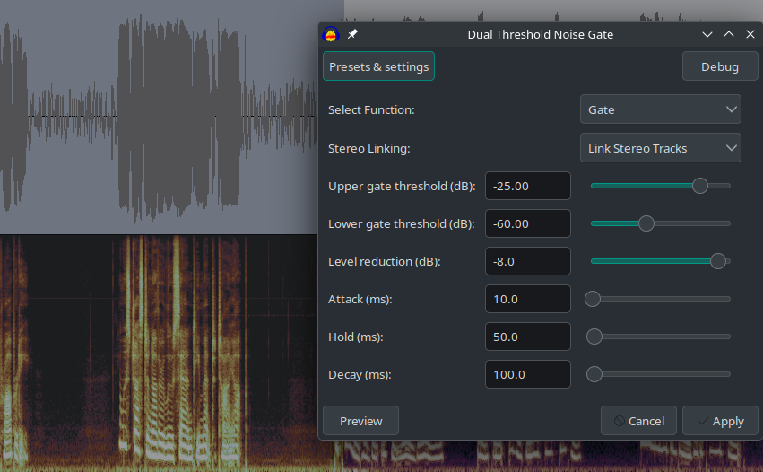
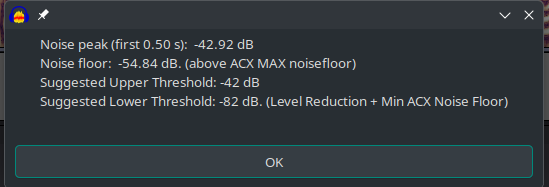
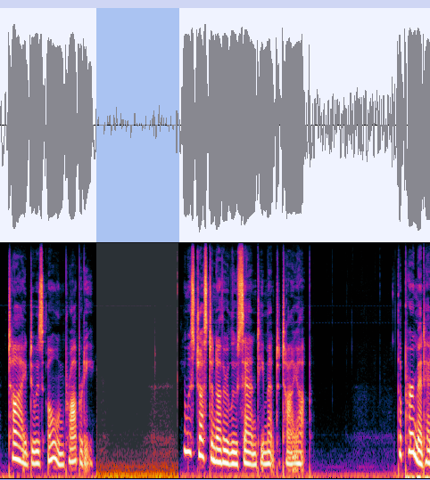

# Simple plugins for audacity.

## Dual Threshold Noise Gate
The default noise gate plugin is useful, but you have to be really careful or it will push your noise floor too low for things like ACX work.
This plugin povides a dual threshold noise gate that allows you to set a lower gate threshold, below which no noise reduction will occur.
Its very similar to the default noise gate within audacity, but it also allows you to set a lower gate threshold, below which no noise reduction will occur.
This is handy to keep from going below the minimum ACX noise floor.
This is an early version, so PLEASE backup and save your work often.

Here's an ACX Check of the selection after running the dual threshold noise gate multiple times with a lower gate of -60dB. (Of course the peak and rms level checks fail because I'm testing a quiet section).

Using this plugin, you can ensure that your track will never fall below the minimum noise floor (if you give it correct parameters).

Example, If you set the lower gate threshold to -70, and then reduce it by -40, yeah, your probably going to go below the minimum, but if you set the lower gate to -75dB and reduce by -10db, you will  never fall below the -90dB ACX minimum noise floor.
Constructive feedback is highly welcome.

Please let me know if you have any issues or suggestions.
Thanks.
